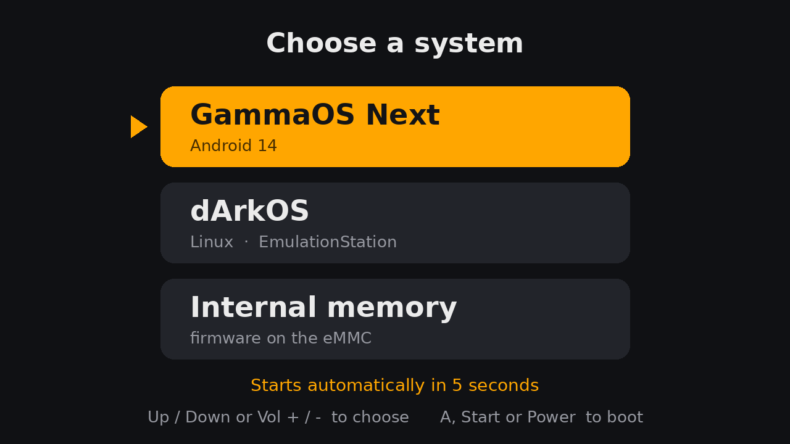

# GammaOS Next и dArkOS на одной карте для AISLPC RG52 Mini

Одна SD-карта с двумя системами для карманной консоли **AISLPC RG52 Mini**
на Rockchip RK3562 — **GammaOS Next** (Android 14) и **dArkOS** (Debian,
EmulationStation) — и меню выбора при включении. Третий пункт меню, по
желанию, перезагружает устройство во внутреннюю память, где стоит прошивка
производителя.

## Что здесь делается

Обе системы для RG52 Mini уже существуют, каждая на своей карте. Переставлять
карты неудобно, поэтому здесь собирается карта, на которой живут обе:

* разделы двух готовых образов переносятся на одну карту так, чтобы каждая
  система нашла свои — dArkOS обращается к ним по номерам, Android по именам;
* в загрузчик добавлено меню: картинки на экране, управление крестовиной и
  кнопками, запоминание последнего выбора;
* игры общие: dArkOS берёт их из папки ROMs Android, отдельного раздела под
  них нет, и всё свободное место на карте достаётся этой папке.

Сами системы для этого не пересобираются: обе знают об общей карте и ведут
себя на ней чуть иначе, чем на своей.

| Часть | Откуда |
|---|---|
| GammaOS Next | [mamaich/GammaOSNext-RG52mini](https://github.com/mamaich/GammaOSNext-RG52mini) — образ карты из выпусков |
| dArkOS | [mamaich/dArkOS_rg52mini](https://github.com/mamaich/dArkOS_rg52mini) — образ карты из выпусков, сборка 10082026 или новее |
| Загрузчик с меню | [mamaich/u-boot-rk3562-rg52mini](https://github.com/mamaich/u-boot-rk3562-rg52mini), основная ветка `next-dev`; патчи — в [`u-boot/`](u-boot) |
| Сборка карты | [`mk-dualboot.py`](mk-dualboot.py) — здесь |
| Кадры меню | [`menu/`](menu) — здесь |

## Скачать

Готовый образ карты — на странице
[выпусков](https://github.com/mamaich/RG52mini-dualboot/releases). Собирать
ничего не нужно: распаковал, записал на карту от 32 ГБ, вставил, включил.
Первой загрузится GammaOS — пройдите её мастер настройки, после этого при
каждом включении появляется меню.

| Выпуск | Дата | Коротко |
|---|---|---|
| [v1.0](https://github.com/mamaich/RG52mini-dualboot/releases/tag/v1.0) — [описание](doc/release-v1.0.md) | 09.10.2026 | Первый: GammaOS Next v1.9 и dArkOS 10082026, меню выбора, общие игры |

## С чего начать

| | |
|---|---|
| **Как устроена карта**: разметка, загрузка, меню, первый запуск, общие игры, обновления | [doc/01-устройство.md](doc/01-устройство.md) |
| **Собрать самому**: образы систем, загрузчик с меню, кадры меню, карта | [doc/02-сборка.md](doc/02-сборка.md) |
| **Правки загрузчика** патчами | [u-boot/](u-boot) |

## Управление меню

| | |
|---|---|
| Вверх / вниз | крестовина или кнопки громкости |
| Запустить | A, Start или короткое нажатие кнопки питания |
| Ничего не нажимать | через 5 с запустится система, выбранная в прошлый раз |
| Открыть меню до первой настройки GammaOS | зажать при включении крестовину вверх или вниз |
| Пункт «Internal memory» | включить в GammaOS Toolbox «Allow reboot to eMMC» |

## Состояние

| Этап | Состояние |
|---|---|
| Разметка общей карты | готово |
| Сборщик карты без прав root | готово, ~7 минут |
| Меню в загрузчике | готово, проверено на устройстве: картинки, кнопки, запуск обеих систем и eMMC, меню при включении кнопкой |
| Тот же загрузчик на карте с одной GammaOS | проверено на устройстве: меню не запускается, время загрузчика и частоты процессора, графики и памяти — как с прежним `rg52mini-1.3`, разгон и перезагрузка во внутреннюю память работают; лога загрузчика нет, порт был отключён |
| Кадры меню | готово, 10 картинок RLE8 по ~50 КБ |
| dArkOS: режим общей карты, игры из Android | готово, сборка 10082026: игры, темы, установщик PortMaster |
| GammaOS: флаги меню, растягивание `userdata` по имени | готово, входит в выпуск GammaOS Next v1.9 |
| GammaOS: обновления по воздуху с загрузчиком с меню | влито в основную ветку загрузчика (`0ea01de2e9`), войдёт в выпуск GammaOS Next v1.9 |
| **Проверка на устройстве** | **пройдена** на образе из GammaOS Next v1.9 (кандидат) и dArkOS 10082026: первый запуск со свежей карты сразу в GammaOS, затем меню, первый запуск dArkOS, общие игры |

## Сборка

Коротко, в Linux или WSL, без root:

    python3 -I mk-dualboot.py --gamma GammaOS.img --darkos dArkOS.img --uboot uboot.img

Что нужно установить, откуда взять образы и как собрать загрузчик — в
[doc/02-сборка.md](doc/02-сборка.md).
